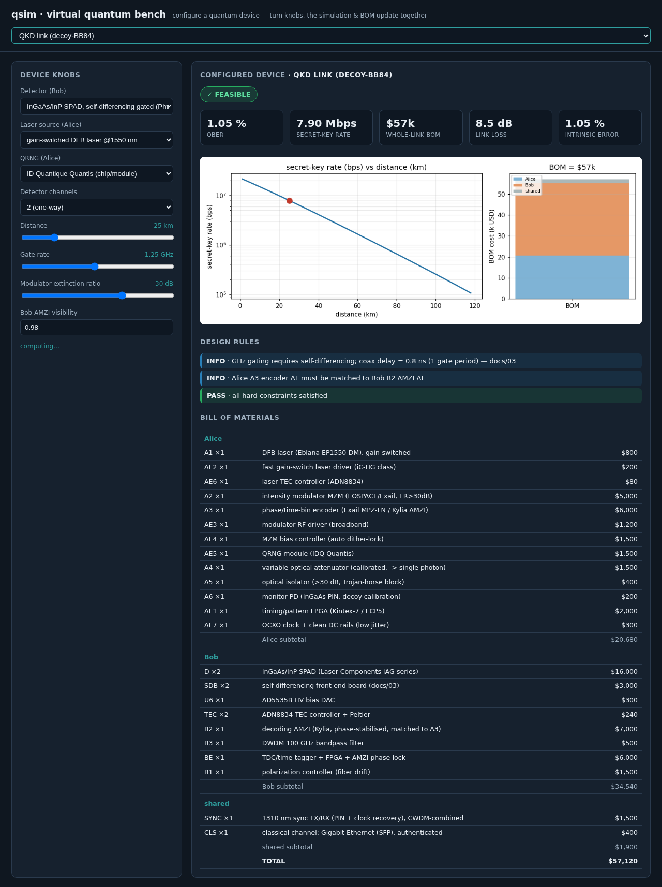
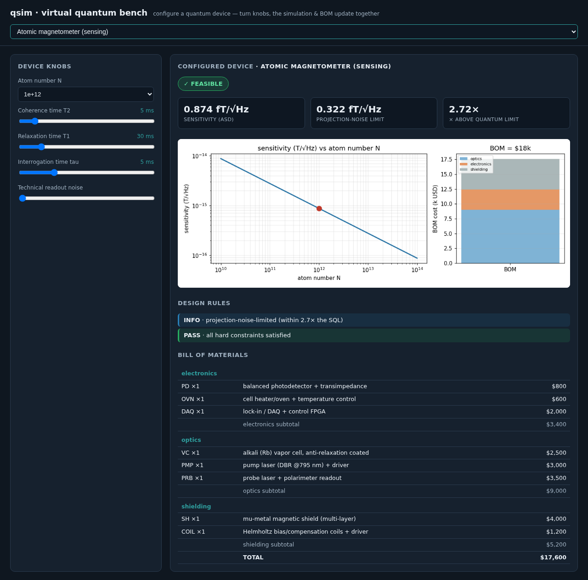
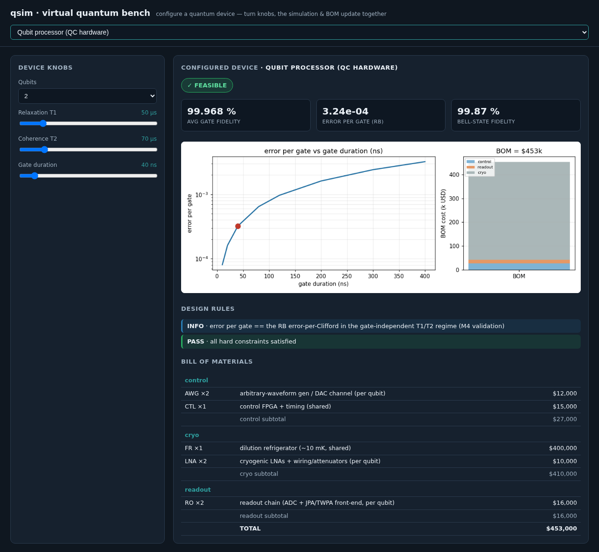
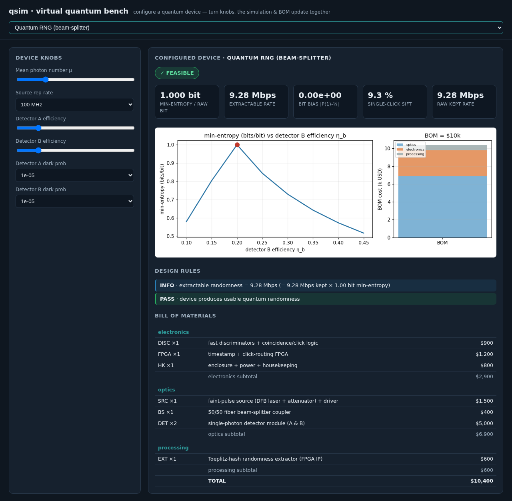

# Quick start — try the virtual quantum bench in 1 minute

> **EN** — `qsim` is an open-source *virtual quantum bench*: it simulates real quantum **devices**
> (not just protocols) down to the hardware — detectors, lasers, boards, noise — and turns one
> design into a working simulation **and** a bill of materials at the same time. One simulation
> kernel runs four different quantum devices, each validated against a published result.
>
> **VI** — `qsim` là một *bàn thí nghiệm lượng tử ảo* mã nguồn mở: nó mô phỏng **thiết bị** lượng
> tử thật (không chỉ giao thức) tới tận phần cứng — detector, laser, board mạch, nhiễu — và biến
> một thiết kế thành cả bản mô phỏng **lẫn** bảng vật tư (BOM) cùng lúc. Một nhân mô phỏng chạy
> được bốn loại thiết bị lượng tử khác nhau, mỗi loại đã được kiểm chứng với một kết quả đã công bố.

---

## 1. Install / Cài đặt

```bash
git clone <this-repo> && cd QResearch
pip install -e ".[gui]"        # numpy/scipy/matplotlib + Flask (for the web bench)
```

Python ≥ 3.10. No QuTiP, no compilers, no GPU — it runs on a modest laptop.

## 2. Prove it runs / Kiểm tra nhanh (≈ 1 s)

```bash
python -m qsim
```

```
  DOMAIN                            HEADLINE                                     BOM   STATUS
  QKD link (decoy-BB84)             QBER 1.05 % · SKR 7.90 Mbps                 $57k   ✓ feasible
  Atomic magnetometer (sensing)     sensitivity 0.874 fT/√Hz · SQL 0.322 fT/√Hz $18k   ✓ feasible
  Qubit processor (QC hardware)     fidelity 99.968 % · err/gate 3.24e-04      $453k   ✓ feasible
  Quantum RNG (beam-splitter)       H_min 1.000 bit · rate 9.28 Mbps            $10k   ✓ feasible
```

Each row is a real device configured from defaults: its headline physics, its hardware cost, and
whether the design is feasible — computed by the same engine, live.

## 3. Turn the knobs / Vặn núm trong trình duyệt

```bash
python -m qsim gui            # opens http://127.0.0.1:8000
```

Pick a domain, drag a slider (distance, detector, atom number, qubit coherence, μ…) and watch the
**simulation, the bill of materials, the board parameters, and the design-rule checks update
together** — the core promise of the bench.

| QKD link | Atomic magnetometer |
|---|---|
|  |  |
| **Qubit processor** | **Quantum RNG** |
|  |  |

## 4. Go deeper / Tìm hiểu sâu hơn

- **Validation suite** — `python -m pytest -q` (every claim above is enforced by a test).
- **Why this matters & the QKD reference design** — [`README.md`](README.md),
  [`docs/01_architecture_and_bom.md`](docs/01_architecture_and_bom.md).
- **The QKD hardware design** (Bob self-differencing gating board: SPICE + schematic + KiCad netlist
  + BOM) — [`docs/03_bob_gating_board.md`](docs/03_bob_gating_board.md).
- **The kernel architecture** (one engine, many domains) —
  [`docs/02_simulator_kernel_spec.md`](docs/02_simulator_kernel_spec.md).
